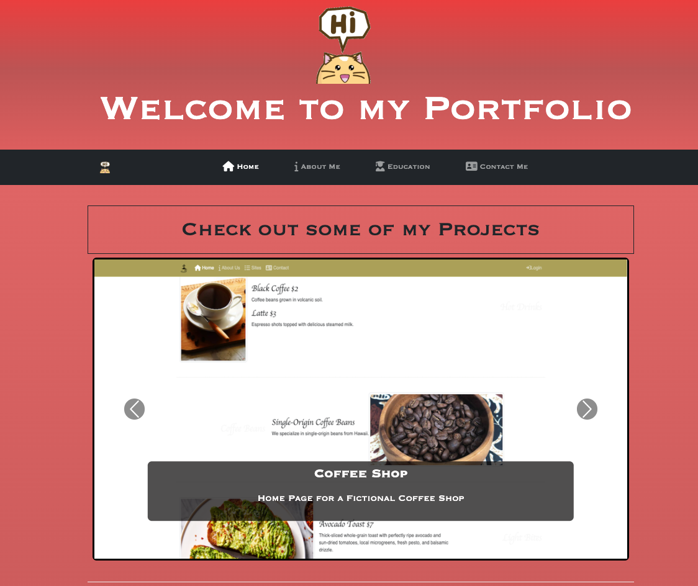
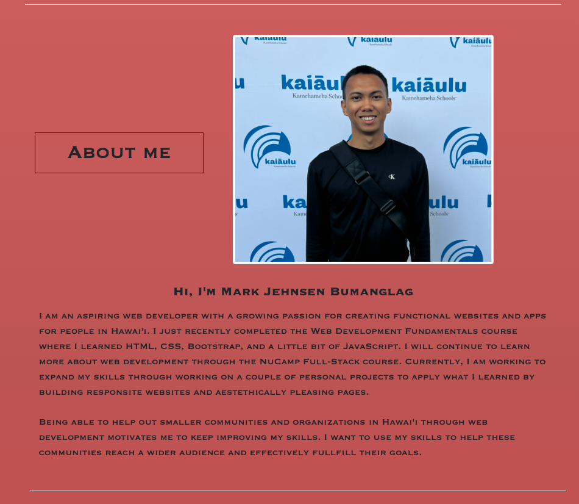
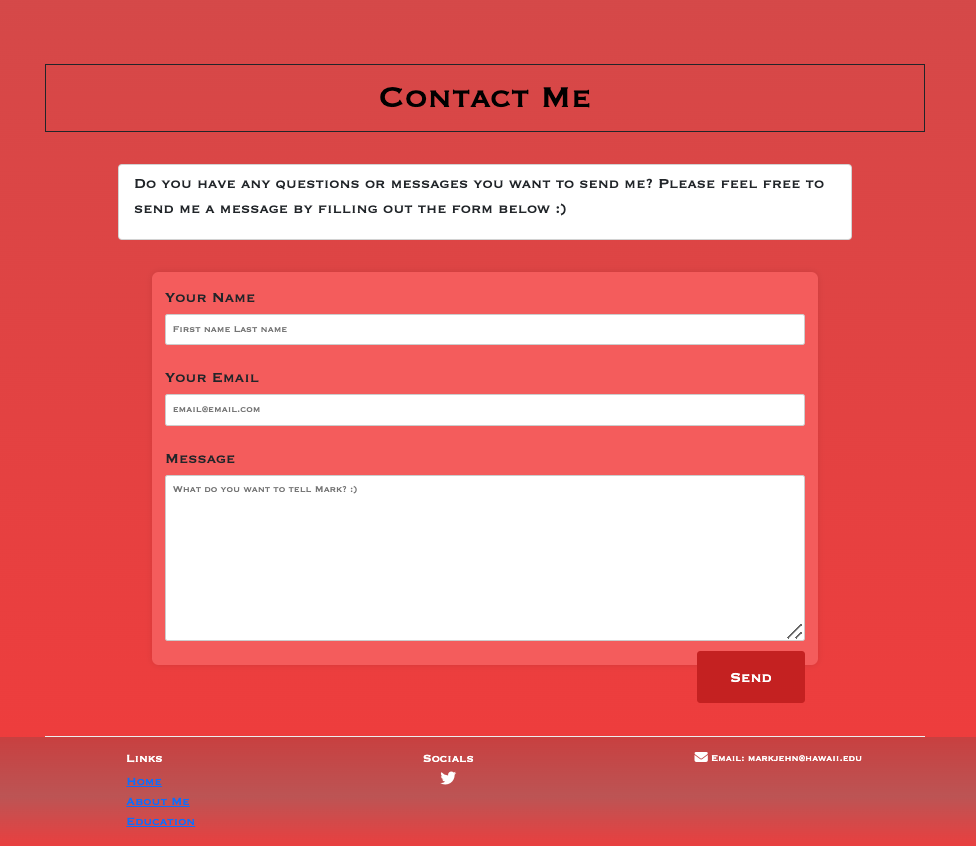

# Project Title: Mark Bumanglag Portfolio
    This project helps users get to know me as an aspiring web developer. 

## Description
    The website shows information about my journey to becoming a web developer by laying out the bootcamps I have taken and will be taking to improve my skills. It also shows why I want to become a web developer and what motivates me to get into this field. 

    A few projects are also shown, though they are very minimal. I plan to add another page with personal projects that I will be creating. 

    Scrolling down to the bottom of the page shows a contact me page in case users want to send me any messages that they'd like for me to read. It also has my contact information (email) and my social media profile (twitter/X).

## Getting Started
    Dependencies
        Reliable Internet
        Browser (e.g., Google Chrome, Safari, Firefox)

## Help
    For any concerns, please reach out to the author via email (markjehn@hawaii.edu)

## Authors
    Mark Bumanglag

## Version History
    0.1 - Initial release to firebase

## Acknowledgements
    NuCamp Bootcamp
    Kamehameha Schools
